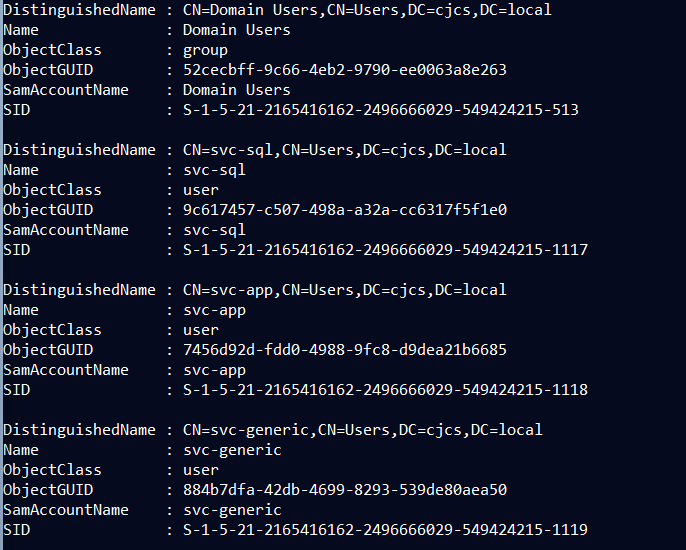

## Weak Password Policy

```powershell
Import-Module ActiveDirectory

# Create a new Fine-Grained Password Policy (PSO)

$PSO = New-ADFineGrainedPasswordPolicy `
    -Name "Weak-Lab-PSO" `
    -Precedence 100 `
    -ComplexityEnabled $false `
    -MinPasswordLength 6 `
    -PasswordHistoryCount 1 `
    -LockoutThreshold 0 `
    -LockoutDuration "00:00:00" `
    -LockoutObservationWindow "00:00:00" `
    -ReversibleEncryptionEnabled $true `
    -ProtectedFromAccidentalDeletion $false

Write-Host "[+] Created super weak Fine-Grained Password Policy: Weak-Lab-PSO" -ForegroundColor Red

# Apply it to our three vulnerable service accounts

Add-ADFineGrainedPasswordPolicySubject "Weak-Lab-PSO" -Subjects "svc-sql","svc-app","svc-generic"

Write-Host "[+] Applied Weak-Lab-PSO to svc-sql, svc-app, svc-generic" -ForegroundColor Yellow

# Also apply to regular users

Add-ADFineGrainedPasswordPolicySubject "Weak-Lab-PSO" -Subjects "Domain Users"

Write-Host "[+] Applied Weak-Lab-PSO to all Domain Users (because legacy apps, bro)" -ForegroundColor Yellow
Write-Host "`nPassword Policy now:" -ForegroundColor Cyan
Write-Host "Min length: 6 chars" -ForegroundColor Cyan
Write-Host "Complexity: OFF" -ForegroundColor Cyan
Write-Host "Lockout: Never" -ForegroundColor Cyan
Write-Host "History: 1 password remembered" -ForegroundColor Cyan
Write-Host "Reversible encryption: ENABLED (cleartext in LSASS!)" -ForegroundColor Red
```

## **MITRE ATT&CK Mapping**

- **T1110.001** - Brute Force: Password Guessing
- **T1110.003** - Brute Force: Password Spraying
- **T1003.001** - OS Credential Dumping: LSASS Memory (reversible encryption)

## **Detection Opportunities**

These misconfigurations create detectable events:

- **Fine-Grained Password Policy creation** (Event ID 5136 - AD object modified)
- **Multiple failed authentication attempts** with no lockout (Event ID 4625)
- **Password spray patterns** - same password across multiple accounts
- **Reversible encryption enabled** = cleartext passwords in LSASS
- **Short passwords accepted** (6 characters minimum)


---

## Weak Passwords

**Verify on DC01:**

```powershell
# Check Fine-Grained Password Policy
Get-ADFineGrainedPasswordPolicy -Filter * | 
    Select-Object Name, MinPasswordLength, ComplexityEnabled, LockoutThreshold, ReversibleEncryptionEnabled

# Check which accounts have the weak policy
Get-ADFineGrainedPasswordPolicy -Identity "Weak-Lab-PSO" | 
    Get-ADFineGrainedPasswordPolicySubject

# Check default domain password policy
Get-ADDefaultDomainPasswordPolicy

# Expected weak settings:
# MinPasswordLength = 6
# ComplexityEnabled = False
# LockoutThreshold = 0 (no lockout)
# ReversibleEncryptionEnabled = True
```





---

## **Impact**

- **No account lockout** = unlimited password guessing
- **Weak passwords allowed** = easy brute force
- **Password spraying** = multiple accounts compromised
- **Reversible encryption** = cleartext passwords if DC compromised
- **No complexity** = "Password1" is valid