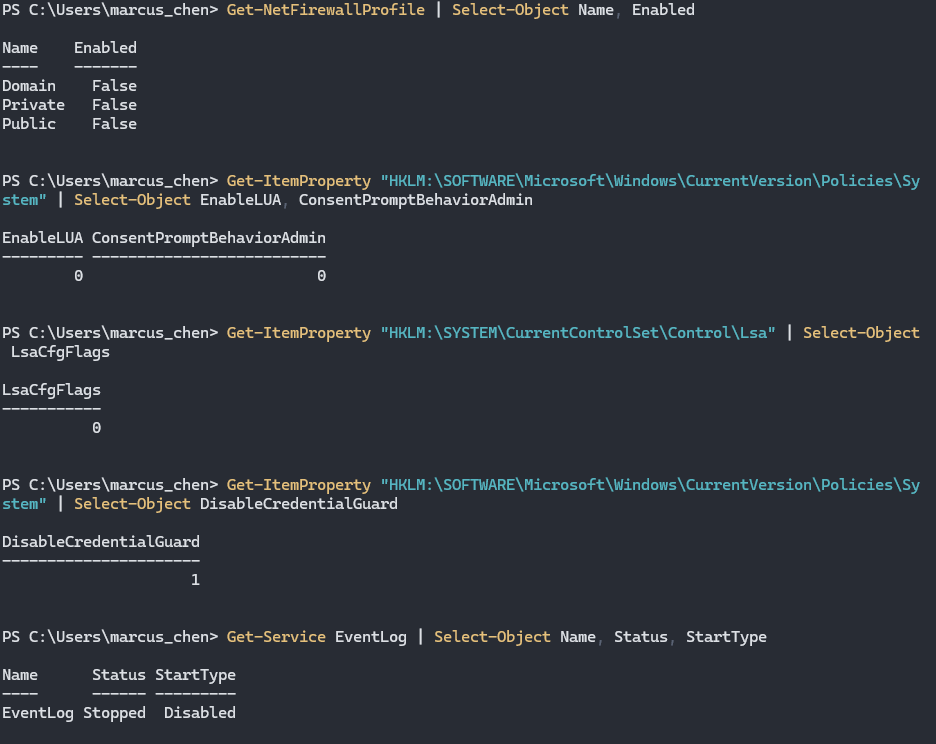

## Disabled Security Controls

```powershell
# Firewall

netsh advfirewall set allprofiles state off

# UAC

reg add HKLM\SOFTWARE\Microsoft\Windows\CurrentVersion\Policies\System /v EnableLUA /t REG_DWORD /d 0 /f

reg add HKLM\SOFTWARE\Microsoft\Windows\CurrentVersion\Policies\System /v ConsentPromptBehaviorAdmin /t REG_DWORD /d 0 /f

# Credential Guard / LSA Protection

reg add HKLM\SYSTEM\CurrentControlSet\Control\Lsa /v LsaCfgFlags /t REG_DWORD /d 0 /f

reg add HKLM\SOFTWARE\Microsoft\Windows\CurrentVersion\Policies\System /v DisableCredentialGuard /t REG_DWORD /d 1 /f

# Event logging (clear + disable)

wevtutil cl Security
wevtutil cl System
wevtutil cl Application

Set-Service EventLog -StartupType Disabled -ErrorAction SilentlyContinue

Stop-Service EventLog -Force -ErrorAction SilentlyContinue
```

## **MITRE ATT&CK Mapping**

- **T1562.001** - Impair Defenses: Disable or Modify Tools
- **T1562.002** - Impair Defenses: Disable Windows Event Logging
- **T1562.004** - Impair Defenses: Disable or Modify System Firewall
- **T1070.001** - Indicator Removal: Clear Windows Event Logs

## **Detection Opportunities**

These misconfigurations create detectable events:

- **Windows Firewall disabled** (Event ID 5025)
- **UAC disabled** via registry (Event ID 4657)
- **Event Log service stopped** (Event ID 1100, 1102 before shutdown)
- **Security logs cleared** (Event ID 1102)
- **Credential Guard disabled** (Event ID 4657)
- **LSA protection disabled** (Event ID 4657)

**Note:** Many of these events are logged BEFORE being disabled, making initial configuration changes detectable, but subsequent activity invisible.


---

### Security Settings Disabled

**Verify on MGR1:**

```powershell
# Check Windows Firewall status (should be OFF)
Get-NetFirewallProfile | Select-Object Name, Enabled

# Check UAC status (0 = disabled)
Get-ItemProperty "HKLM:\SOFTWARE\Microsoft\Windows\CurrentVersion\Policies\System" | 
    Select-Object EnableLUA, ConsentPromptBehaviorAdmin

# Check LSA protection (0 = disabled)
Get-ItemProperty "HKLM:\SYSTEM\CurrentControlSet\Control\Lsa" | 
    Select-Object LsaCfgFlags

# Check Credential Guard (1 = disabled)
Get-ItemProperty "HKLM:\SOFTWARE\Microsoft\Windows\CurrentVersion\Policies\System" -ErrorAction SilentlyContinue | 
    Select-Object DisableCredentialGuard

# Check Event Log service status (should be Stopped/Disabled)
Get-Service EventLog | Select-Object Name, Status, StartType

# Check if event logs exist (should be empty/cleared)
Get-EventLog -LogName Security -Newest 10 -ErrorAction SilentlyContinue
Get-EventLog -LogName System -Newest 10 -ErrorAction SilentlyContinue
Get-EventLog -LogName Application -Newest 10 -ErrorAction SilentlyContinue

# Expected vulnerable configuration:
# All firewall profiles = False (disabled)
# EnableLUA = 0 (UAC off)
# ConsentPromptBehaviorAdmin = 0 (no prompts)
# LsaCfgFlags = 0 (LSA protection off)
# DisableCredentialGuard = 1 (Credential Guard off)
# EventLog service = Stopped, Disabled
# Event logs = Cleared or inaccessible

# Check Defender status (if installed)
Get-MpComputerStatus | Select-Object AntivirusEnabled, RealTimeProtectionEnabled

# Check AppLocker status
Get-AppLockerPolicy -Effective -Xml

# Check Windows Defender Firewall detailed status
netsh advfirewall show allprofiles state

# List all disabled security services
Get-Service | Where-Object {$_.Status -eq 'Stopped' -and $_.Name -match 'Defender|Firewall|Event|Security'} | 
    Select-Object Name, Status, StartType
```




---

## **Impact**

- **No firewall protection** = all ports accessible from network
- **UAC disabled** = silent privilege escalation, no admin prompts
- **LSA protection disabled** = credentials extractable from memory
- **Credential Guard disabled** = no virtualization-based security
- **Event logging disabled** = zero forensic visibility
- **Event logs cleared** = historical activity destroyed
- **No security telemetry** = attacks completely invisible
- **Defense evasion** = malware runs undetected
- **Persistence easy** = install backdoors without alerts
- **Lateral movement undetected** = no network activity logs
- **Complete blind spot** = SOC cannot see this system
- **Mimikatz friendly** = dump credentials without detection
- **Pass-the-hash enabled** = no credential protection