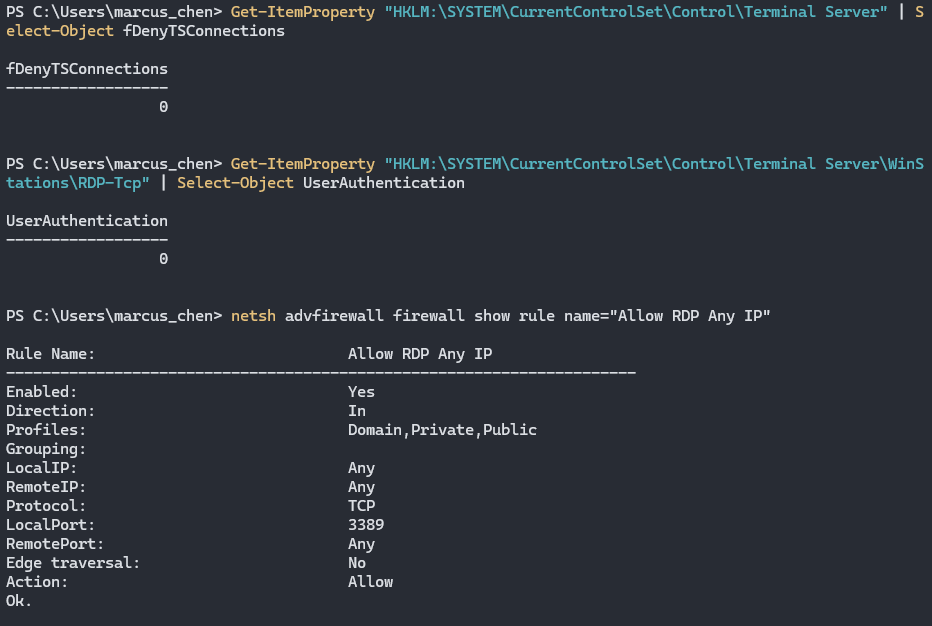

## RDP Misconfiguration

```powershell
# 1. Enable RDP

reg add "HKLM\SYSTEM\CurrentControlSet\Control\Terminal Server" /v fDenyTSConnections /t REG_DWORD /d 0 /f

# 2. Disable NLA

reg add "HKLM\SYSTEM\CurrentControlSet\Control\Terminal Server\WinStations\RDP-Tcp" /v UserAuthentication /t REG_DWORD /d 0 /f

# 3. Allow RDP from any IP

netsh advfirewall firewall add rule name="Allow RDP Any IP" dir=in action=allow protocol=TCP localport=3389

# 4. Unlimited concurrent sessions

reg add "HKLM\SYSTEM\CurrentControlSet\Control\Terminal Server" /v MaxUserSessions /t REG_DWORD /d 0 /f

reg add "HKLM\SOFTWARE\Policies\Microsoft\Windows NT\Terminal Services" /v MaxInstanceCount /t REG_DWORD /d 0xffffffff /f

# 5. Allow saving credentials in RDP files

reg add "HKLM\SOFTWARE\Policies\Microsoft\Windows NT\Terminal Services" /v DisablePasswordSaving /t REG_DWORD /d 0 /f

# 6. Disable RDP connection logging (fixed line)

reg add "HKLM\SOFTWARE\Microsoft\Windows\CurrentVersion\Policies\System\Audit" /v ProcessCreationIncludeCmdLine_Enabled /t REG_DWORD /d 0 /f

wevtutil sl Microsoft-Windows-TerminalServices-RemoteConnectionManager/Operational /e:false
```

## **MITRE ATT&CK Mapping**

- **T1021.001** - Remote Services: Remote Desktop Protocol
- **T1110** - Brute Force (RDP)
- **T1563.002** - Remote Service Session Hijacking: RDP Hijacking
- **T1070.002** - Indicator Removal: Clear Windows Event Logs

## **Detection Opportunities**

These misconfigurations create detectable events:

- **RDP enabled** without NLA (Event ID 4624 Type 10 - no pre-auth)
- **Firewall rule creation** for RDP (Event ID 2004)
- **Registry changes** to Terminal Server settings (Event ID 4657)
- **RDP connection logging disabled** (Event Log service stopped)
- **Multiple concurrent RDP sessions** from same account (Event ID 4624)
- **Failed RDP authentication attempts** with no rate limiting (Event ID 4625)


---

### RDP Vulnerabilities 

**Verify on MGR1:**

```powershell
# Check if RDP is enabled (0 = disabled, vulnerable)
Get-ItemProperty "HKLM:\SYSTEM\CurrentControlSet\Control\Terminal Server" | 
    Select-Object fDenyTSConnections

# Check NLA status (0 = disabled, vulnerable)
Get-ItemProperty "HKLM:\SYSTEM\CurrentControlSet\Control\Terminal Server\WinStations\RDP-Tcp" | 
    Select-Object UserAuthentication

# Check firewall rules for RDP
netsh advfirewall firewall show rule name="Allow RDP Any IP"

# Check concurrent session limits (0 = unlimited)
Get-ItemProperty "HKLM:\SYSTEM\CurrentControlSet\Control\Terminal Server" | 
    Select-Object MaxUserSessions

# Check password saving policy (0 = allowed, vulnerable)
reg query "HKLM\SOFTWARE\Policies\Microsoft\Windows NT\Terminal Services" /v DisablePasswordSaving

# Check RDP connection logging status
Get-EventLog -LogName "Microsoft-Windows-TerminalServices-RemoteConnectionManager/Operational" -ErrorAction SilentlyContinue

# Expected vulnerable configuration:
# fDenyTSConnections = 0 (RDP enabled)
# UserAuthentication = 0 (NLA disabled)
# MaxUserSessions = 0 (unlimited)
# DisablePasswordSaving = 0 (saving allowed)
# RDP logging disabled or not found
```



![[Pasted image 20251203195128.png]]


---

## **Impact**

- **NLA disabled** = no pre-authentication, easier brute force
- **Firewall wide open** = RDP accessible from entire network
- **Unlimited sessions** = multiple concurrent connections
- **Password saving enabled** = credentials stored in .rdp files
- **Logging disabled** = no forensic evidence of RDP access
- **Brute force viable** = no connection throttling or lockout
- **Session hijacking** = steal existing sessions
- **Lateral movement** = use MGR1 as jump box to rest of network
- **Domain Admin session** = compromise DA credentials via RDP
