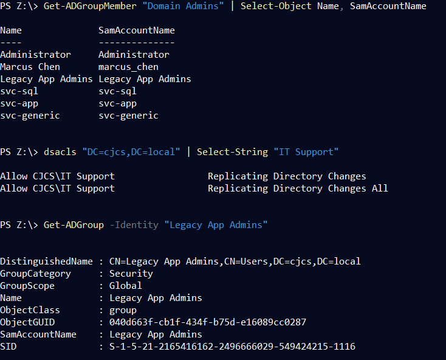
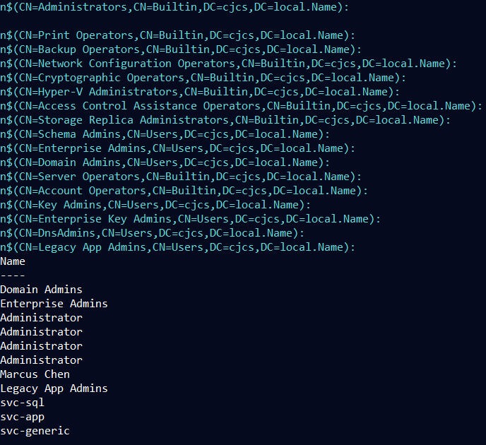

# Dangerous Group Memberships

```powershell
Import-Module ActiveDirectory

# 1. Service accounts → Domain Admins

Add-ADGroupMember "Domain Admins" -Members "svc-sql","svc-app","svc-generic"

# 2. Create IT Support group if missing

New-ADGroup -Name "IT Support" -GroupScope Global -ErrorAction SilentlyContinue

# 3. Give IT Support DCSync rights

dsacls "DC=cjcs,DC=local" /g "cjcs\IT Support:CA;Replicating Directory Changes"
dsacls "DC=cjcs,DC=local" /g "cjcs\IT Support:CA;Replicating Directory Changes All"

# 4. Backup Operators → Domain Admins

Add-ADGroupMember "Domain Admins" -Members "Backup Operators"

# 5. Create Legacy App Admins group and make it Domain Admin

New-ADGroup -Name "Legacy App Admins" -GroupScope Global -ErrorAction SilentlyContinue

Add-ADGroupMember "Domain Admins" -Members "Legacy App Admins"
```

## **MITRE ATT&CK Mapping**

- **T1069.002** - Permission Groups Discovery: Domain Groups
- **T1003.006** - OS Credential Dumping: DCSync
- **T1098.001** - Account Manipulation: Additional Cloud Credentials
- **T1484.001** - Domain Policy Modification: Group Policy Modification

## **Detection Opportunities**

These misconfigurations create detectable events:

- **Service accounts added to Domain Admins** (Event ID 4728)
- **DCSync rights granted** (Event ID 5136 - AD object permission change)
- **Backup Operators added to Domain Admins** (Event ID 4728)
- **New privileged group creation** (Event ID 4731)
- **Unusual accounts in privileged groups** via regular audits


---

### Excessive Domain Admins

**Verify on DC01:**

```powershell
# Check Domain Admins membership
Get-ADGroupMember "Domain Admins" | Select-Object Name, SamAccountName

# Check IT Support DCSync rights
dsacls "DC=cjcs,DC=local" | Select-String "IT Support"

# Check all privileged groups
Get-ADGroup -Filter {Name -like "*Admin*" -or Name -like "*Operator*"} | 
    ForEach-Object {
        Write-Host "`n$($_.Name):" -ForegroundColor Cyan
        Get-ADGroupMember $_.Name | Select-Object Name
    }

# Check Legacy App Admins
Get-ADGroupMember "Legacy App Admins" | Select-Object Name, MemberOf

# Expected issues:
# - svc-sql, svc-app, svc-generic in Domain Admins
# - IT Support has DCSync rights
# - Backup Operators in Domain Admins
# - Legacy App Admins in Domain Admins
```






---

## **Impact**

- **Service accounts as Domain Admins** = single compromise = full domain
- **DCSync rights to non-admins** = steal all credentials without admin
- **Backup Operators as Domain Admins** = all backup staff are god-mode
- **Legacy groups with DA** = forgotten accounts with full access
- **Attack path amplification** = multiple routes to Domain Admin


---

# SMB Signing Disabled

```powershell
# 1. Disable SMB client signing (always)

reg add "HKLM\SYSTEM\CurrentControlSet\Services\LanmanWorkstation\Parameters" /v RequireSecuritySignature /t REG_DWORD /d 0 /f

reg add "HKLM\SYSTEM\CurrentControlSet\Services\LanmanWorkstation\Parameters" /v EnableSecuritySignature /t REG_DWORD /d 0 /f

# 2. Disable SMB server signing (always) on the DC

reg add "HKLM\SYSTEM\CurrentControlSet\Services\LanmanServer\Parameters" /v RequireSecuritySignature /t REG_DWORD /d 0 /f

reg add "HKLM\SYSTEM\CurrentControlSet\Services\LanmanServer\Parameters" /v EnableSecuritySignature /t REG_DWORD /d 0 /f

# 3. Disable mandatory SMB encryption

reg add "HKLM\SYSTEM\CurrentControlSet\Services\LanmanServer\Parameters" /v EncryptData /t REG_DWORD /d 0 /f

# 4. Disable LDAP signing requirements

reg add "HKLM\SYSTEM\CurrentControlSet\Services\NTDS\Parameters" /v LDAPServerIntegrity /t REG_DWORD /d 1 /f

# 5. Allow NTLMv1 and LM (remove restrictions)

reg add "HKLM\SYSTEM\CurrentControlSet\Control\Lsa" /v LmCompatibilityLevel /t REG_DWORD /d 1 /f

reg add "HKLM\SYSTEM\CurrentControlSet\Control\Lsa\MSV1_0" /v NtlmMinClientSec /t REG_DWORD /d 0 /f

reg add "HKLM\SYSTEM\CurrentControlSet\Control\Lsa\MSV1_0" /v NtlmMinServerSec /t REG_DWORD /d 0 /f

# 6. Force Group Policy update on the DC

gpupdate /force

Write-Host "`nSMB signing, encryption, LDAP signing, and NTLM restrictions DISABLED" -ForegroundColor Red

Write-Host "DC01 is now perfect for NTLM relay, Responder, and Kerberoasting" -ForegroundColor Yellow
```

## **MITRE ATT&CK Mapping**

- **T1557.001** - Man-in-the-Middle: LLMNR/NBT-NS Poisoning and SMB Relay
- **T1187** - Forced Authentication
- **T1003** - OS Credential Dumping (via relay)

## **Detection Opportunities**

These misconfigurations create detectable events:

- **Registry changes** to SMB signing settings (Event ID 4657)
- **NTLMv1 authentication attempts** in Security logs (Event ID 4624 with LM authentication)
- **Unsigned SMB connections** in network traffic
- **LDAP without signing** (detectable via packet capture)
- **Group Policy updates** that weaken security (Event ID 1502)


---

### SMB Relay Potential

**Verify on DC01:**

```powershell
# Check SMB client signing
Get-ItemProperty "HKLM:\SYSTEM\CurrentControlSet\Services\LanmanWorkstation\Parameters" | 
    Select-Object RequireSecuritySignature, EnableSecuritySignature

# Check SMB server signing
Get-ItemProperty "HKLM:\SYSTEM\CurrentControlSet\Services\LanmanServer\Parameters" | 
    Select-Object RequireSecuritySignature, EnableSecuritySignature, EncryptData

# Check LDAP signing
Get-ItemProperty "HKLM:\SYSTEM\CurrentControlSet\Services\NTDS\Parameters" | 
    Select-Object LDAPServerIntegrity

# Check NTLM compatibility level
Get-ItemProperty "HKLM:\SYSTEM\CurrentControlSet\Control\Lsa" | 
    Select-Object LmCompatibilityLevel

# Expected values for vulnerable config:
# All *SecuritySignature = 0
# EncryptData = 0
# LDAPServerIntegrity = 1 (accepts unsigned)
# LmCompatibilityLevel = 1 (allows LM and NTLMv1)
```


---

## **Impact**

- **NTLM relay attacks** = compromise Domain Controller
- **Credential capture** = domain account passwords
- **Man-in-the-middle** = intercept and modify SMB traffic
- **NTLMv1 downgrade** = weak hashes, easily crackable


---

# Weak Password Policy

```powershell
Import-Module ActiveDirectory

# Create a new Fine-Grained Password Policy (PSO)

$PSO = New-ADFineGrainedPasswordPolicy `
    -Name "Weak-Lab-PSO" `
    -Precedence 100 `
    -ComplexityEnabled $false `
    -MinPasswordLength 6 `
    -PasswordHistoryCount 1 `
    -LockoutThreshold 0 `
    -LockoutDuration "00:00:00" `
    -LockoutObservationWindow "00:00:00" `
    -ReversibleEncryptionEnabled $true `
    -ProtectedFromAccidentalDeletion $false

Write-Host "[+] Created super weak Fine-Grained Password Policy: Weak-Lab-PSO" -ForegroundColor Red

# Apply it to our three vulnerable service accounts

Add-ADFineGrainedPasswordPolicySubject "Weak-Lab-PSO" -Subjects "svc-sql","svc-app","svc-generic"

Write-Host "[+] Applied Weak-Lab-PSO to svc-sql, svc-app, svc-generic" -ForegroundColor Yellow

# Also apply to regular users

Add-ADFineGrainedPasswordPolicySubject "Weak-Lab-PSO" -Subjects "Domain Users"

Write-Host "[+] Applied Weak-Lab-PSO to all Domain Users (because legacy apps, bro)" -ForegroundColor Yellow
Write-Host "`nPassword Policy now:" -ForegroundColor Cyan
Write-Host "Min length: 6 chars" -ForegroundColor Cyan
Write-Host "Complexity: OFF" -ForegroundColor Cyan
Write-Host "Lockout: Never" -ForegroundColor Cyan
Write-Host "History: 1 password remembered" -ForegroundColor Cyan
Write-Host "Reversible encryption: ENABLED (cleartext in LSASS!)" -ForegroundColor Red
```

## **MITRE ATT&CK Mapping**

- **T1110.001** - Brute Force: Password Guessing
- **T1110.003** - Brute Force: Password Spraying
- **T1003.001** - OS Credential Dumping: LSASS Memory (reversible encryption)

## **Detection Opportunities**

These misconfigurations create detectable events:

- **Fine-Grained Password Policy creation** (Event ID 5136 - AD object modified)
- **Multiple failed authentication attempts** with no lockout (Event ID 4625)
- **Password spray patterns** - same password across multiple accounts
- **Reversible encryption enabled** = cleartext passwords in LSASS
- **Short passwords accepted** (6 characters minimum)


---

## Weak Passwords

**Verify on DC01:**

```powershell
# Check Fine-Grained Password Policy
Get-ADFineGrainedPasswordPolicy -Filter * | 
    Select-Object Name, MinPasswordLength, ComplexityEnabled, LockoutThreshold, ReversibleEncryptionEnabled

# Check which accounts have the weak policy
Get-ADFineGrainedPasswordPolicy -Identity "Weak-Lab-PSO" | 
    Get-ADFineGrainedPasswordPolicySubject

# Check default domain password policy
Get-ADDefaultDomainPasswordPolicy

# Expected weak settings:
# MinPasswordLength = 6
# ComplexityEnabled = False
# LockoutThreshold = 0 (no lockout)
# ReversibleEncryptionEnabled = True
```


---

## **Impact**

- **No account lockout** = unlimited password guessing
- **Weak passwords allowed** = easy brute force
- **Password spraying** = multiple accounts compromised
- **Reversible encryption** = cleartext passwords if DC compromised
- **No complexity** = "Password1" is valid


---

# Weak Service Accounts

```powershell
Import-Module ActiveDirectory

# svc-sql

New-ADUser -Name "svc-sql" -SamAccountName "svc-sql" -UserPrincipalName "svc-sql@cjcs.local" -Description "SQL Service - over-privileged" -AccountPassword (ConvertTo-SecureString "ServicePassword123!" -AsPlainText -Force) -Enabled $true -PasswordNeverExpires $true

Add-ADGroupMember "Domain Admins" "svc-sql"

Set-ADAccountControl "svc-sql" -DoesNotRequirePreAuth $true

setspn -A "MSSQLSvc/app01.cjcs.local:1433" "svc-sql"

# svc-app

New-ADUser -Name "svc-app" -SamAccountName "svc-app" -UserPrincipalName "svc-app@cjcs.local" -Description "Web App Service - excessive rights" -AccountPassword (ConvertTo-SecureString "ServicePassword123!" -AsPlainText -Force) -Enabled $true -PasswordNeverExpires $true

Add-ADGroupMember "Domain Admins" "svc-app"

Set-ADAccountControl "svc-app" -DoesNotRequirePreAuth $true

setspn -A "HTTP/app01.cjcs.local:80" "svc-app"

# svc-generic (no Domain Admin)

New-ADUser -Name "svc-generic" -SamAccountName "svc-generic" -UserPrincipalName "svc-generic@cjcs.local" -Description "Generic test account - no DA" -AccountPassword (ConvertTo-SecureString "ServicePassword123!" -AsPlainText -Force) -Enabled $true -PasswordNeverExpires $true

Set-ADAccountControl "svc-generic" -DoesNotRequirePreAuth $true

setspn -A "CIFS/dc01.cjcs.local" "svc-generic"

Write-Host "`nPhase 1 vulnerable service accounts created!" -ForegroundColor Green
Write-Host "svc-sql and svc-app = Domain Admins + Kerberoastable + AS-REP roastable" -ForegroundColor Yellow
Write-Host "svc-generic = Kerberoastable + AS-REP roastable (no DA)" -ForegroundColor Yellow
```

## **MITRE ATT&CK Mapping**

- **T1558.003** - Kerberoasting
- **T1558.004** - AS-REP Roasting
- **T1078.002** - Valid Accounts: Domain Accounts
- **T1098** - Account Manipulation

## **Detection Opportunities**

These misconfigurations create detectable events:

- **SPN registration** for user accounts (Event ID 4738)
- **Service account creation** with Domain Admin membership (Event ID 4720, 4728)
- **DoesNotRequirePreAuth enabled** (Event ID 4738)
- **TGS-REQ with RC4 encryption** = Kerberoasting (Event ID 4769)
- **AS-REQ without pre-auth** = AS-REP Roasting (Event ID 4768)


---

### Service Accounts with Domain Admin

**Verify on DC01:**

```powershell
# List service accounts with SPNs
Get-ADUser -Filter {ServicePrincipalName -like "*"} -Properties ServicePrincipalName, MemberOf, DoesNotRequirePreAuth | 
    Select-Object Name, ServicePrincipalName, MemberOf, DoesNotRequirePreAuth

# Check specific accounts
Get-ADUser svc-sql -Properties * | Select-Object Name, MemberOf, ServicePrincipalName, DoesNotRequirePreAuth
Get-ADUser svc-app -Properties * | Select-Object Name, MemberOf, ServicePrincipalName, DoesNotRequirePreAuth
Get-ADUser svc-generic -Properties * | Select-Object Name, MemberOf, ServicePrincipalName, DoesNotRequirePreAuth

# Expected vulnerabilities:
# - svc-sql and svc-app = Domain Admins
# - All three have SPNs (Kerberoastable)
# - All three have DoesNotRequirePreAuth = True (AS-REP Roastable)
```


---

## **Impact**

- **Kerberoasting** = offline password cracking
- **AS-REP Roasting** = offline password cracking without credentials
- **Domain Admin service accounts** = complete domain compromise
- **Weak passwords** = ServicePassword123! cracks in seconds
- **DCSync capability** = all domain password hashes